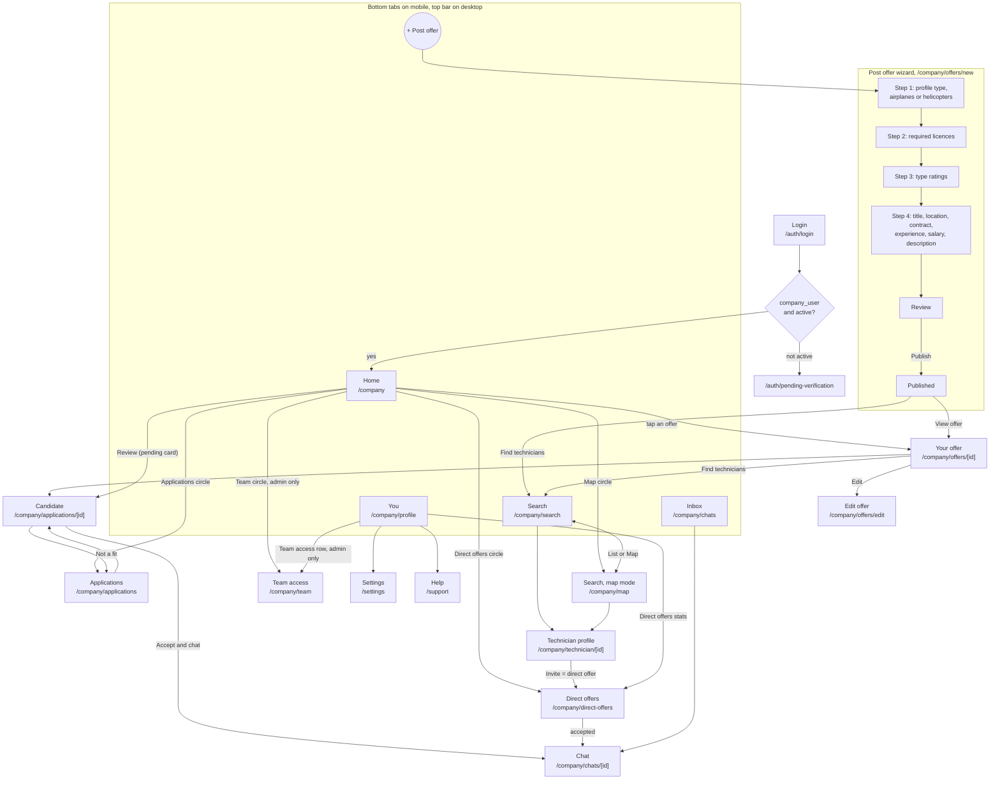
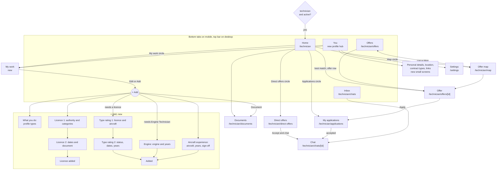

# UI redesign ("Wallapop style") — company and technician areas

This document is the single source of truth for the UI redesign. It replaces `docs/COMPANY_UI_REDESIGN.md`.

Status: **approved by the owner (2026-10-06)**. Nothing is pending. Section 8 (Review answers) was added after the pre-implementation review; where it differs from earlier sections or from the mockups, section 8 wins.

This is a **UI and navigation change**. It does not change business logic, matching, validations or the data model. Exceptions are listed explicitly (profile photos, D2). Every migration follows the rules in `CLAUDE.md`, including explicit owner confirmation before applying it.

Out of scope: the admin area.

---

## 0. Mockups

The mockups live in `docs/redesign/mockups/`. They are the visual reference for every screen: layout, spacing, colours, sizes and copy.

- Company screens: `W-*.dc.html` (mobile) and `W-D-*.dc.html` (desktop).
- Technician screens: `T-*.dc.html` (mobile only, see section 5).
- Shared pieces: `WTabBar` (company bottom bar), `WTopBar` (company desktop top bar), `WPostHeader` (company wizard header), `TTabBar` (technician bottom bar), `TStepHeader` (technician wizard header).

How to read them:

- Static HTML with inline styles. The style values are the design values.
- `{{ ... }}`, `<sc-for>` and `<sc-if>` are loops and conditions over **sample data**. All names, numbers, offers, companies, countries and percentages are examples. Real data comes from `src/repositories/v2/*`.
- `<dc-import name="X">` means "the shared component X goes here".
- `WAvatar` is not included: faces and company logos in the mockups are placeholders. See D2.
- Ignore `support.js`, `data-props` and the `<script>` blocks, except where they show what a control does (for example, which licence categories add which profile type).
- Do not copy the HTML. Rebuild each screen with React Native components.

---

## 1. Shared rules (both areas)

### Navigation pattern
- A bottom tab bar with five items and a raised round "+" button in the middle. The "+" opens a creation flow; it is not a real tab.
- Tab root screens show the tab bar. Every other screen is **pushed on top and hides the tab bar**, with a back arrow.
- On wide screens (around 1024 px and up) the bottom bar becomes a **top bar** (logo, search, Inbox, You, primary action) with section tabs under it. Lists become grids, detail pages use two columns, Inbox shows list and chat side by side. The company desktop mockups (`W-D-*`) show the pattern; the technician area follows the same rules.

### Visual system
Put tokens and base components in one place (today `src/components/company/CompanyUI.tsx`; the technician area should use the same tokens), so every screen picks them up.

- Background white. Soft surfaces `#EEF3F7` and `#F3F6F9`. Lines `#E6ECF1`.
- Text `#0E1A2B`, secondary `#526274`, tertiary `#66768A`.
- One action colour: `#0B6A9E`.
- Amber only for "needs attention": `#FDE7B5` / `#7A3F06`.
- Red only for notification counts: `#D42C2C`.
- Green only for available, accepted, added or a good match: `#D3F1E3` / `#157F4F`.
- Cards 16–24 px radius, pill buttons and chips, touch targets at least 44 px.
- Icons: `lucide-react-native`.
- Font: Nunito Sans for all text, Nunito 900 for the "Aviation Job Talent" logo, added with `expo-font` (D4).

### Wizards
- One question per screen, a header with back arrow and "Step N of M" progress, the main button fixed at the bottom.
- Things already on the profile are shown as "✓ Added" (green) and link to where they can be edited. They are never offered twice.
- Options that need something first are shown greyed with what is missing ("Add a licence first", "Tick Engine Technician above"). They are not hidden.

### Avatars and photos (D2)
- People in a circle, company logos in a rounded square (radius about 28% of the size). With no photo, initials on a soft colour.
- A technician's photo is visible exactly where the technician's name is visible today, and hidden wherever the app hides the technician's identity today. Where hidden, show the no-photo fallback.

---

## 2. Company area: navigation map

- Map is Search in map mode: the List / Map toggle switches between `/company/search` and `/company/map` and keeps the filters.
- Candidate (from an application) and Technician profile (from search or map) share one layout. Actions differ: "Not a fit" / "Accept and chat" for a candidate, "Invite" for a technician found in search.

## 3. Company area: screens

| Screen | Mockup | Route | Exists today | What changes |
|---|---|---|---|---|
| Home | `W-Home` | `/company` | `index.tsx` (hub) | Rewrite: search pill, "pending" card, shortcut circles (Applications, Direct offers, Map, Team for admins), list of your offers. The stats grid and navigation list go away. |
| Search, list | `W-Search` | `/company/search` | yes | Filter chips, 2-column cards, floating "Map" button. |
| Search, map | `W-Map` | `/company/map` | yes (`TechnicianMap.web/.native`) | Country bubbles with counts, bottom sheet with the technicians of the selected country, floating "List" button. Keep the offer-match logic. |
| Technician profile | `W-Candidate` | `/company/technician/[id]` | yes | Same layout as Candidate, action "Invite". |
| Applications | `W-Applications` | `/company/applications` | yes | Chips All / New / Accepted / Not a fit, "New" and "Earlier" sections. |
| Candidate | `W-Candidate` | `/company/applications/[id]` | yes | Photo hero, match %, licence, sticky bar "Not a fit" / "Accept and chat". |
| Direct offers | `W-Direct` | `/company/direct-offers` (+ `[id]`) | yes | Status chips Waiting / Accepted / Declined, "Invite more technicians". |
| Your offer | `W-Offer` | `/company/offers/[id]` | yes | Header, requirements, candidates of this offer, "Edit" and "Find technicians". |
| Post offer wizard | `W-Post`, `W-Post2..4`, `W-PostReview`, `W-PostDone` | `/company/offers/new` | single form | Same fields split into steps (D3). |
| Edit offer | as the wizard | `/company/offers/edit` | yes | Same sections as the wizard. |
| Inbox | `W-Inbox` | `/company/chats` | yes | Becomes a tab. Technician photo with a small offer badge. |
| Chat | `W-Chat` | `/company/chats/[id]` | yes | Offer context card on top, bubbles, input bar. |
| You | `W-You` | `/company/profile` | yes | Becomes a tab: company header, direct offer stats, company details, Team access row (admin only), account rows. |
| Team access | `W-Team` | `/company/team` | yes | Role counts, member list; member actions and "Invite" in bottom sheets (React Native `Modal`). Keep "last admin cannot be removed or demoted". |
| Requests (legacy) | none | `/company/requests` | yes | No change (D5). |

### Company roles

| | Admin | Recruiter | Viewer |
|---|---|---|---|
| Team circle on Home | yes | no | no |
| Team access row in You | yes | no | no |
| Edit company details | yes | no | no |
| Offers, applications, direct offers, chats | yes | yes | existing permission rules |

Do not invent permissions. When the Team circle is hidden, Home shows three circles.

---

## 4. Technician area: navigation map

## 5. Technician area: screens

Only mobile mockups exist for the technician area. Applications, Inbox, Chat and Map have no technician mockup: use the company patterns (`W-Applications`, `W-Inbox`, `W-Chat`, `W-Map`) with technician content (offers and companies instead of technicians).

| Screen | Mockup | Route | Exists today | What changes |
|---|---|---|---|---|
| Home | `T-Home` | `/technician` | `index.tsx` (hub) | Rewrite: search pill, "best match" card, shortcut circles (Applications, Direct offers, Map, My work), "Offers for you" list. The stats grid and navigation list go away. Desktop has no circles: the "You" card links to My work and Documents (item 36). |
| Offers | `T-Search` | `/technician/offers` | yes | Filter chips, 2-column cards with company logo and match %, floating "Map" button. |
| Offer | `T-Offer` | `/technician/offers/[id]` | yes | Company logo hero, match % and label, chips (airplanes or helicopters, contract, salary). One checklist "What they ask vs. your profile" replaces the Requirements and Match sections (T7). Company card. Sticky bottom: privacy note and "Apply". |
| Direct offers | `T-Direct` | `/technician/direct-offers` (+ `[id]`) | yes | "Decline" and "Accept and chat" directly on each card. |
| You | `T-You` | new hub (today the profile is `profile.tsx`) | no | Photo with a change button, name, ID, verified chip. **Availability** switch (Open to offers / Unavailable). Rows: My work, Documents, Location, Contract types, Personal details, Professional links. Account rows. |
| My work | `T-Quals` | new | no | "What you do" (profile types, with the licence that locks each one), licences as cards with their type ratings inside, aircraft experience, engine experience (only for Engine Technicians, otherwise a locked row that explains why). |
| Personal details, Location, Contract types, Professional links | none | new | fields exist in `profile.tsx` | One small screen each, same fields and validations as today. |
| Documents | `T-Docs` | `/technician/documents` | yes | Counts, big "Upload a document" button, list of files with status. |
| + Add | `T-Add` | new | no | Top: "What you do" chips (profile types). Bottom: Licence, Type rating, Aircraft experience, Engine experience, Document (T2). |
| Add licence | `T-Lic`, `T-LicDates`, `T-LicDone` | new | logic in `profile.tsx` | Step 1 authority and categories (multi-select). Step 2 issue and expiry dates, optional document. Final screen. |
| Add type rating | `T-Rat`, `T-RatDetails`, `T-Done` | new | logic in `profile.tsx` | Step 1 licence it hangs from, then aircraft and engine search filtered by that licence. Step 2 current or not, dates, years. |
| Add engine | `T-Eng`, `T-Done` | new | `EngineExperienceEditor` | One step: engine search and optional years. |
| Add aircraft experience | none | new | logic in `profile.tsx` | Same as the type rating flow without the licence step: aircraft search, years, and the FAA sign-off option when it applies today. |

### Technician rules to keep (already in the repo, do not reimplement)

- Licences add and lock profile types: use `typesImpliedByLicenses` and `typesLockedByLicenses` in `src/constants/licenses.ts`. Part-66 A1–A4, B1.x, B3 and L give Mechanic; B2 and B2L give Avionics Technician; FAA A and A&P tick Mechanic without locking it.
- Engines exist only for Engine Technicians: `src/utils/profileEngines.ts`. Removing the type with engines shows the existing warning.
- Type ratings hang from a licence and the catalog is filtered by what that licence covers (existing logic in `profile.tsx` and `src/utils/individualTypeRatingScope`).
- Aircraft sign-off only with FAA A or A&P (migration 094).
- Authorities, licence categories, aircraft, ratings and engines come from the repo catalogs. The mockups copy the EASA category list for UK CAA, CASA and UAE GCAA only as a placeholder.
- Every validation that runs today when the profile is saved (for example `profileHabilitationIssues`) keeps running.

---

## 6. Decisions

### Company
- **D1 APPROVED.** Bottom tabs replace the hub dashboard (top bar on desktop).
- **D2 APPROVED. Profile photos** for technicians, team members and company logos. Needs a Supabase Storage bucket, a migration with the photo field and `expo-image-picker`. Visibility rule in section 1. The migration still needs owner confirmation before applying, as `CLAUDE.md` requires.
- **D3 APPROVED. Post offer as steps** using the existing sections of `offers/new.tsx`:
  1. Profile type and airplanes or helicopters (plus "only unlicensed" if it applies).
  2. Required licences (authority, category, accepted equivalent authorities).
  3. Type ratings.
  4. Title, location, contract type, minimum years of experience, salary, description.
  5. Review (each block with an "Edit" link), then publish.

  Every existing field and section (including `OfferEngineSection` and `OnlyUnlicensedSection`) lands in a step. No field is dropped; validations stay the same. The mockups show fewer fields than the real form: follow the real form.
- **D4 APPROVED. Font:** Nunito Sans and Nunito via `expo-font`.
- **D5.** `/company/requests`: no change for now.

### Technician
- **T1 APPROVED.** Bottom tabs: Home, Offers, + Add, Inbox, You.
- **T2 APPROVED. The "+" screen** shows the profile types on top and what can be added below. Engine experience stays greyed with "Tick Engine Technician above" until the type is ticked: the type must exist first, as today (no rule change). Type rating is greyed with "Add a licence first" when the technician has no licence.
- **T3 APPROVED. The profile is split** into the You hub, My work and small screens. All existing fields stay.
- **T4 APPROVED. Each part saves on its own.** Today the whole profile has one "Save Changes" button (`handleSave` in `profile.tsx`). In the new design there is no global save: each small screen and each wizard saves only what it touches, when its own button is pressed ("Add licence", "Add type rating", "Save"). Every validation of today's save must run on each partial save, and dependent changes must stay consistent (types from licences, ratings of a removed licence, engines of a removed type, FAA sign-off). No data model change.
- **T5 APPROVED. Licence adds a type.** When the chosen categories add a profile type the technician does not have yet, step 1 shows "Adds Avionics Technician to what you do" (or Mechanic), and the final screen confirms "Avionics Technician added to what you do". Use the functions in `src/constants/licenses.ts`.
- **T6 APPROVED.** Items already on the profile appear as "✓ Added" in the wizards and link to My work.
- **T7 APPROVED. Offer page.** The match breakdown bars (15/15, 45/45…) are replaced by the checklist; the percentage and its label stay. The matching computation does not change.

---

## 7. Implementation order

Work in phases. Stop at the end of each phase so the owner can review it before starting the next.

1. **Foundations:** tokens, fonts (D4), shared components (tab bar with "+", step header, avatar with fallback, chips, list rows, bottom sheet).
2. **Company navigation and Home** (D1).
3. **Company screens:** search and map, applications and candidate, direct offers, your offer, inbox and chat, You, team access.
4. **Company post-offer wizard** (D3).
5. **Technician navigation, Home, Offers, Offer page, Direct offers** (T1, T7).
6. **Technician You, My work, small profile screens, "+" and wizards** (T2, T3, T4, T5, T6).
7. **Profile photos** (D2), after the migration is confirmed.
8. **Desktop layouts** for both areas.

After each phase, `npm test` must stay green.

---

## 8. Review answers (2026-10-06)

The owner's answers to the pre-implementation review. They are part of the approved design. Where they differ from sections 0–7 or from the mockups, these answers win.

### General rule
Behaviour stays exactly as it is today. The redesign changes the look and the navigation, not what the app does. If a mockup or this document clashes with what the code does today, the code wins. Do not add features that do not exist today, except the ones approved in this document.

### Material
- `docs/redesign/mockups/` now holds the 59-mockup set. It replaces the earlier 44.
- The company mockups — mobile (`W-*`, `C-*`) and desktop (`W-D-*`) — already reflect these answers.
- The technician mockups (`T-*`) do not yet. Where they clash with these answers, these answers win.

### Style (phase 1)
1. The new style applies to the **whole app**, including login, settings and admin. No screen mixes the old and the new style. Fonts come from `@expo-google-fonts/nunito-sans` and `@expo-google-fonts/nunito`.
2. Colours: change `companyUi`, `techUi` and the common theme (`src/theme`) directly, so the whole app picks them up at once.
3. Font everywhere. A custom font on Android ignores `fontWeight`, so there is one shared text component that uses the font file of each weight, and every `<Text>` in the app is replaced with it mechanically, changing nothing else in each screen.
   - At the end of phase 1 the whole app has the new font and colours. The layout of each screen changes in its own phase.
   - Login, settings and admin have no mockup: they take the new font, colours and buttons without changing what they do.
   - No temporary sample screen is needed.
4. Avatar of an anonymous technician: a generic person icon. Never initials, nor anything that identifies them.
5. Bottom sheets on mobile: React Native `Modal`, no drag. They close with a button or by tapping outside. On desktop they are centred dialogs.

### Navigation
6. The bottom bar shows only on the root screen of each tab; every other screen hides it.
   - On desktop the top bar shows on every screen. Sections: Home, Applications, Direct offers, Your offers, Map, and Team (admin only).
   - The search box in the top bar is a button that opens search. There is no free text.
7. "+ Post offer" for a Viewer: shown greyed out; tapping it explains that a Viewer cannot post offers.
8. Team: `/company/team` becomes a real screen that reuses `CompanyTeamManagement` without changing its logic. The Team circle on Home and a row in You lead to it, both admin only. When inviting, the name is optional, as today.
9. The technician's You keeps the URL `/technician/profile`. My work and the other new screens hang from it.
10. No URL changes: use `(tabs)` groups, and always `useGoBack`.

### Behaviour
11. Percentages, as today:
    - Company search: the % appears only when an offer is chosen in the selector at the top. With an offer chosen, each card has "Send offer", with an optional personal message.
    - Technician map: selecting a technician shows the % for each published offer, each with "Send offer".
    - Technician: sees the offers' percentages as today.
12. No new features: no free-text search, no "My licences" filter, no notification bell.
13. Company offers:
    - "See all" on Home goes to `/company/offers`, with published, draft, closed and expired offers.
    - The offer page keeps today's technician list: applications and direct offers first, then the best matches, with % and "Send direct offer".
    - Publish, close, reopen and delete go in the "⋯" menu, with today's confirmations.
14. Post offer wizard, with the real fields:
    - Step 1: profile type, and airplanes or helicopters.
    - Step 2: today's question ("Does this job need certified work?"; on engine offers, "Should candidates hold a licence?").
      If yes: authority, licence, "Also accept licences from" and the Part-66 category on FAA offers, as today.
      If no: "Only technicians without a licence".
      Unlicensed trades skip this step.
    - Step 3: several aircraft, with "all or any" and its note; on engine offers, one engine.
    - Step 4: title, description, contract (Permanent, Long-term, Short-term), minimum years of experience, salary, and location (country, optional city).
      Salary has a switch that shows or hides its fields. Off means no salary is saved, the same as today when none is added.
    - Review: an "Edit" link on each block, plus "Save draft" and "Publish".
    - "Step N of M" is variable and counts only the steps that apply.
    - Dependencies: every dependency of today's form stays. Each choice filters the next ones as today (airplanes/helicopters filter licences and aircraft; the profile type decides the licence question, which licences appear, and whether the offer asks for aircraft or an engine), using the same functions in `offerFormRules.ts`, not rewritten.
      Going back to an earlier step and changing something clears what no longer fits, as today.
      The same applies to the technician wizards and to the filters.
15. Confirmations: every confirmation that exists today stays, including the one for accepting (it reveals identity), for both company and technician.
16. Applications: the real statuses (pending, accepted, rejected, withdrawn, expired). "New" means pending; there is no read/unread state and none is added. Filters: All, Pending, Accepted, Rejected.
17. Application page (company): everything shown today (match breakdown with points, cover note, licences, experience, engines, requirement notices).
    - Identity and documents only after accepting. After accepting: "Open chat" and "View profile".
    - A Viewer cannot accept or reject: the buttons are shown locked, with today's text.
18. The technician's full profile (company side) opens only after an accepted contact, as today.
19. Direct offers: the real statuses (awaiting response, accepted, declined, withdrawn, expired). The detail page allows withdrawing the offer, with today's confirmation.
20. Chat: a Viewer cannot write; today's text is shown ("Viewer role cannot send messages.").
21. Company You: activity as today (Requests sent, Accepted, Awaiting reply). Company details are edited on their own screen, admin only.

### Map and filters
22. The technician map stays exactly as it is today; only the button to switch between list and map is added. The map mockup only sets the style.
23. Technician filters are rebuilt and are the **same** in search and on the map (this replaces the earlier note about search and map not sharing filters). They are kept when switching between list and map. Mockups: `W-Filters` and the `WFilters` component.
    - What they do: technician type; several can be chosen.
    - Airplanes or helicopters: any, airplanes or helicopters.
    - Licence: authority and categories. Only the categories that fit the chosen types and airplanes/helicopters appear. If every chosen type is unlicensed, the section does not appear.
    - Aircraft: a search filtered by airplanes/helicopters; several can be added, each removed with its ✕.
    - Engine: only when Engine Technician is chosen. Same format as aircraft: search, several, removed with ✕.
    - Availability and "Verified only".
    - Today's rule stays: any option within a section, and every section in use at once.

    Use the catalogs and the licence–type–product rules already in the repo; the lists in the mockup are examples. **This touches logic: before doing it, explain in plain words what will change and wait for the owner's OK.**

### Technician
24. Offer page checklist: the same 5 criteria that score points today. ✓ with full points, partial with some, grey with 0. Below it go today's notices (blockers, expiry, equivalence, clarifications), without repeating what the checklist already says.
25. Profile types and availability save on tap, with no button. If removing a type deletes engines, today's warning shows first.
26. Licence with several categories: one dates screen, with one block per category.
    - "Expires" only for the authorities whose licences expire today (not FAA or CASA).
    - The document button is a shortcut to the normal upload. It is not linked to the licence, as today.
27. When an FAA A or A&P is added, the final screen uses today's text: "An FAA A or A&P ticks Mechanic, but you can untick it if you only do avionics." (`faaMechanicTypeNote`, which shows it only when no other licence locks Mechanic).

### How to work (approved)
28. Do not touch `offerMatchExplain` or `matchPairs`.
29. Move `handleSave` into a use case in `src/` that each screen calls, with today's validations. Point the test at that function.
30. In the photos phase, the photo is hidden in `technician_public_view` the same way as the name. That migration needs the owner's confirmation.
31. In every phase: `npm test` and `npm run ts`, test on web, Android and iOS, and do not delete an old screen until the new one covers it entirely.

### Optional engine note (approved 2026-10-08)
32. Engine offers have one optional note in step 3, styled like the aircraft note, with engine-specific placeholder text. Migration 097 adds `offers.required_engine_notes` (nullable text), applied and registered as `20261008072830` after explicit confirmation and before the client change. Create/edit saves it; empty or whitespace-only input removes it. The wizard review and both offer detail pages show the note beside the engine. Those detail pages also show the existing aircraft notes, which they previously omitted. Notes are informational and never affect matching.
    - Changing engine clears its old note; selecting the same engine keeps it. Moving to an aircraft offer clears it too. Editing asks before discarding a nonempty note. Unrelated edits preserve it.
    - Tests: note round trips in `testOfferForm.ts`, loading/review/transitions in `testOfferWizard.ts`; database save/read/permissions and regression checks via `node scripts/rehearseOfferEngineNotes.cjs --installed`, all rolled back.
    - Owner checks with a session: create with/without note; review and both offer pages; edit, reload and clear; change engine (cancel/confirm), switch to aircraft; verify existing aircraft notes. Check web, Android and iOS. The assistant has not logged in.

### Company contacts and technician history (approved 2026-10-08)
33. Search adds `All technicians` / `Your contacts (N)` above the results on mobile and desktop. All retains its existing search flow. Contacts load automatically from the company's accepted applications/direct offers, deduplicated and checked through the same `getViewForCompany` / `isUnlocked` gate as the full profile. Missing/inactive or locked profiles are excluded. N is the total before shared filters; contacts use the existing filter function. The selected tab follows the filters' navigation lifetime, including reset before the first search. The map has no contact tab.
    - With an offer selected, existing matching provides scores. Contacts remain visible when ineligible or hard-blocked, with `Doesn't meet this offer` and no Send offer button; existing application/direct-offer badges remain visible. Ineligible pairs have no score, so no percentage is invented. Partial qualification matches remain governed by existing matching; no new threshold. No matching or direct-offer write logic changes.
    - Contact cards show name, initials, View profile and Open chat. One conversation opens directly; several offer a chooser. Viewer retains existing read-only permissions.
34. The full technician profile adds `With your company` after documents, in the desktop main column. It reads the company's existing applications, direct offers and offers through their repositories; filters by company and technician; sorts pending first, then creation date descending within both groups. Rows show kind, offer title, existing status colours and relative creation date, and open the original relationship detail. Unlinked legacy direct offers say `No linked offer`; unavailable titles say `Offer unavailable`.
    - All profile entry points (Applications, Direct offers, offer page, search, map and chat) use `/company/technician/[id]`. Relationship details remain separate; there is no alternative full profile. `?from=chat` still hides chat actions on the profile, including with the new history visible.
    - No schema, RLS or permission changes. Additional reads reuse the existing repositories. Tests: `test:company-contacts` covers contact membership, filters, retained ineligible results, mismatch/actions, ordering, navigation and tab lifetime; included in `npm test` alongside `check:nested-buttons`.
    - Owner checks with a session: mobile and desktop tabs/count/empty state; contacts immediately after either acceptance; shared filters and reset via another section; selected offers with eligible/ineligible contacts and existing statuses; one/multiple chats; profile history order/detail links and Viewer; profile opened from chat. No assistant login.

### Company-wide technician identity (requested 2026-10-08)
35. Every company surface shows a technician's name and initials when already unlocked for that company, including when the current relationship is pending and an older relationship granted access. Locked technicians show their anonymous code and generic avatar. The existing `technician_public_view` / `getViewForCompany` / `isUnlocked` gate remains authoritative; no schema, RLS or permission changes.
    - Fixed offer candidates (including send sheet and accessibility label), All technicians and map identity loading, map avatar, Applications list, Direct offers list and Home pending card. Your contacts, application/direct-offer details, Inbox and chat already followed the rule and are covered by the regression.
    - `test:company-identity`, included in `npm test`, runs actual loaders and components offline: prior accepted application/direct offer with a currently pending relationship, unlocked/locked identities, names and actual avatar initials/generic icons, mobile/desktop, other-company acceptance, pending flags and a protected view that still denies identity. Your contacts excludes locked technicians. No assistant login.

### My work on Home (requested 2026-10-09)
36. Mobile Home: the fourth circle is "My work" (`/technician/profile/work`) instead of "Documents". Desktop Home: the "You" card links to My work and Documents (it no longer has "Your profile"; You stays in the top bar). Documents is still reached from You, from the "+" (Document) and from the licence wizard.
    - My work drops its header "+ Add": each section's add button opens its wizard. The "+ Add" in the bottom and top bars does not change.
    - Tests: `test:technician-nav` (circles, desktop card, the remaining Documents entry points) and `test:technician-add` (no header "+ Add"; both bars still open the "+"). No assistant login.

### Profile photos and company logos (phase 7, 2026-10-09)
37. Migration 098 applied after approval and explicit confirmation of development project `rwauwuremzkizeoginza`; registered as `20261009094539`. Technician photos are private, with the same `offer_accepted_between` rule as names in both `technician_public_view` and Storage. Signed photo URLs are disallowed. Company logos are public; only company/platform admins may change them. See `PHASE_7_IMAGES_PLAN.md` for policies, rehearsal and limitations.
    - Shared image editor: the technician changes the photo only by tapping the avatar on the You card (mobile You and the desktop You header); Personal details no longer offers it (owner request, 2026-10-10). Company: Change logo in C-EditCompany. Square crop and reduction to at most 512 px before upload; changing/removing immediately updates the shared avatar. Locked identities remain generic; missing images use initials.
    - Photos flow through existing visible-name surfaces (Home, search, contacts, maps, offer candidates, relationships, profile and chat). Logos flow through company-name avatars. No matching, score or offer-send logic changes.
    - `test:profile-images` covers real use case/repository/editor behavior offline, cache isolation, removal/fallback and account-file cleanup; `test:company-identity` covers gated rendering. `npm run ts`, `npm test` including nested buttons, installed SQL rehearsals and Expo exports pass. No assistant login; device/session tests remain with the owner.
    - HTTP 400 / NoSuchKey correction: real Storage logs showed the gateway's preliminary `object.get_authenticated_info` read, omitted by 098. Migration 099 applied after the owner requested the fix (version `20261009152917`); permits GET-info and HEAD-info under the same owner/identity gates. Rehearsed before application and checked afterwards: original 67 cases plus four metadata-operation variants (67 each), security/write/H3 regressions, verified rollback and negative controls. Owner browser/device retest remains pending; the assistant has not logged in.
    - `delete-account` includes photo cleanup; deployed as version 8 on 2026-10-10 after the owner's OK.
